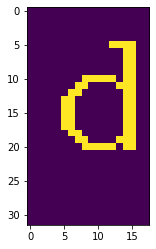
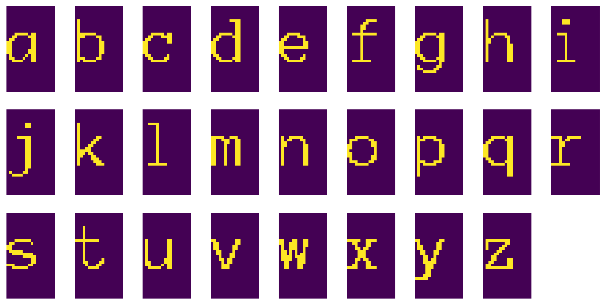
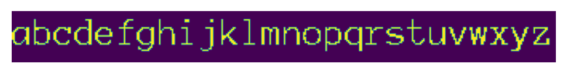
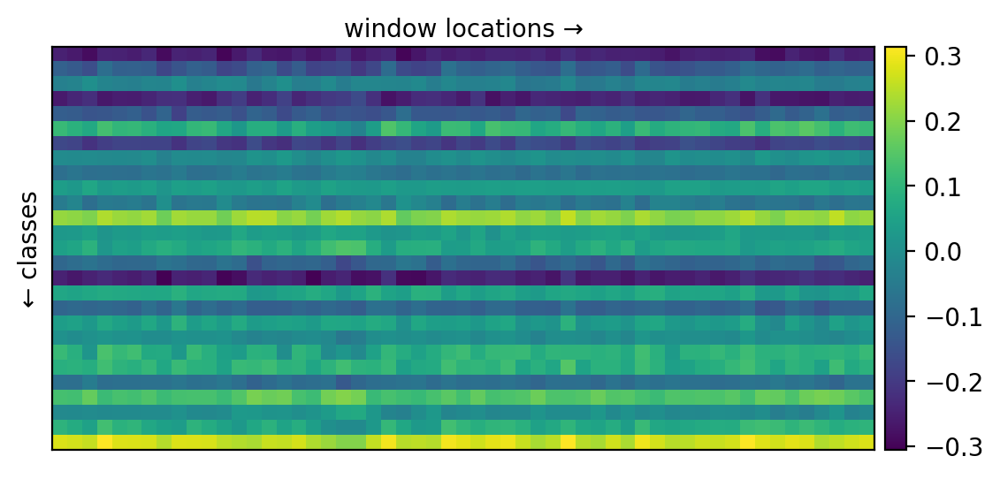
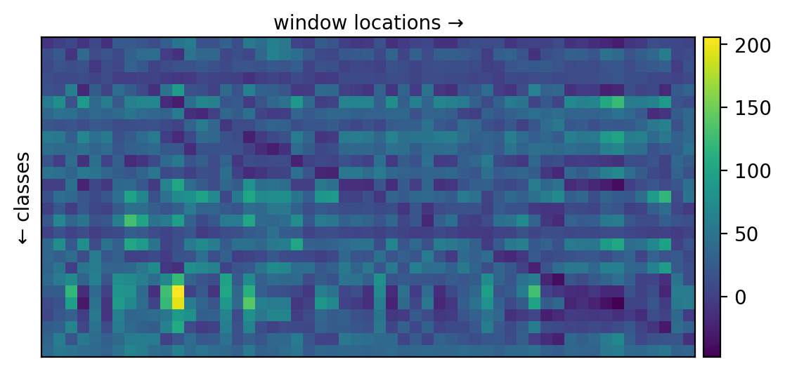
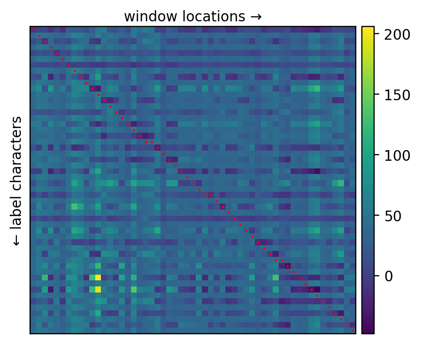
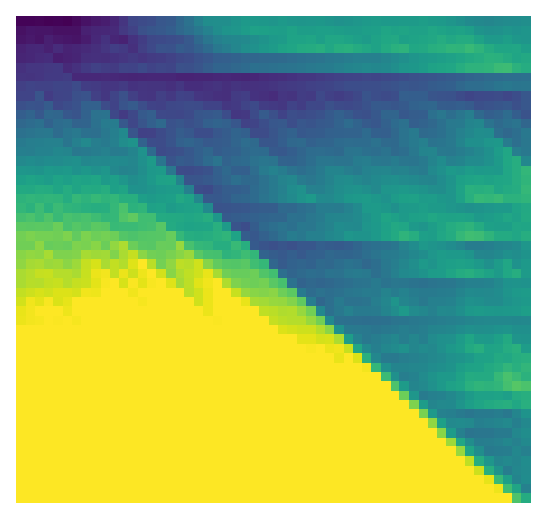
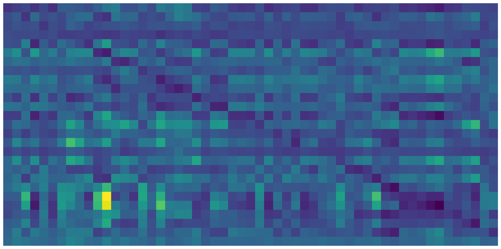
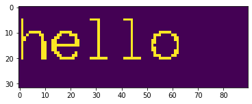
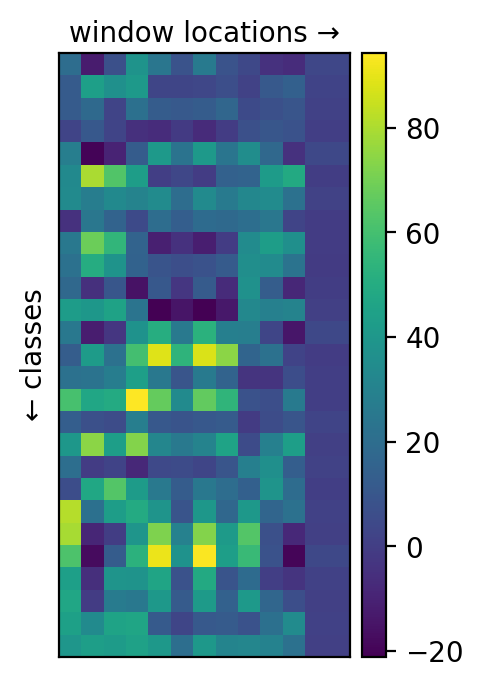

# Energy-Based Models and Structured Prediction

Structured prediction broadly refers to any problem involving predicting structured values, as opposed to plain scalars. Examples of structured outputs include graphs and text.

We're going to work with text. The task is to transcribe a word from an image. The difficulty here is that different words have different lengths, so we can't just have fixed number of outputs.

We will implement a dynamic programming algorithm to align the text image with the predictions. We will also compare our solution to GTN framework.


```python
!pip install gtn==0.0.0
```

    Requirement already satisfied: gtn==0.0.0 in /opt/anaconda3/lib/python3.9/site-packages (0.0.0)


## Dataset
As always, the first thing to do is implementing the dataset. We're going to create a dataset that creates images of random words. We'll also include some augmentations, such as jitter (moving the character horizontally).


```python
! mkdir fonts
! curl --output fonts/font.zip https://www.fontsquirrel.com/fonts/download/Anonymous
! unzip -n fonts/font.zip -d fonts
```

    mkdir: fonts: File exists
      % Total    % Received % Xferd  Average Speed   Time    Time     Time  Current
                                     Dload  Upload   Total   Spent    Left  Speed
    100 29805  100 29805    0     0  63635      0 --:--:-- --:--:-- --:--:-- 63550
    Archive:  fonts/font.zip


```python
from PIL import ImageDraw, ImageFont
import string
import random
import torch
import torchvision
from torchvision import transforms
from PIL import Image # PIL is a library to process images
from matplotlib import pyplot as plt
import gtn

simple_transforms = transforms.Compose([
                                    transforms.ToTensor(), 
                                ])

class SimpleWordsDataset(torch.utils.data.IterableDataset):

  def __init__(self, max_length, len=100, jitter=False, noise=False):
    self.max_length = max_length
    self.transforms = transforms.ToTensor()
    self.len = len
    self.jitter = jitter
    self.noise = noise
  
  def __len__(self):
    return self.len

  def __iter__(self):
    for _ in range(self.len):
        text = ''.join([random.choice(string.ascii_lowercase) for i in range(self.max_length)])
        img = self.draw_text(text, jitter=self.jitter, noise=self.noise)
        yield img, text
  
  def draw_text(self, text, length=None, jitter=False, noise=False):
    if length == None:
        length = 18 * len(text)
    img = Image.new('L', (length, 32))
    fnt = ImageFont.truetype("fonts/Anonymous.ttf", 20)

    d = ImageDraw.Draw(img)
    pos = (0, 5)
    if jitter:
        pos = (random.randint(0, 7), 5)
    else:
        pos = (0, 5)
    d.text(pos, text, fill=1, font=fnt)

    img = self.transforms(img)
    img[img > 0] = 1 
    
    if noise:
        img += torch.bernoulli(torch.ones_like(img) * 0.1)
        img = img.clamp(0, 1)
        

    return img[0]

sds = SimpleWordsDataset(1, jitter=True, noise=False)
img = next(iter(sds))[0]
plt.imshow(img)
``` 

    


We can look at what the entire alphabet looks like in this dataset.


```python
fig, ax = plt.subplots(3, 9, figsize=(12, 6), dpi=200)

for i, c in enumerate(string.ascii_lowercase):
    row = i // 9
    col = i % 9
    ax[row][col].imshow(sds.draw_text(c))
    ax[row][col].axis('off')
ax[2][8].axis('off')
    
plt.show()
```


    

    


We can also put the entire alphabet in one image.


```python
alphabet = sds.draw_text(string.ascii_lowercase, 340)
plt.figure(dpi=200)
plt.imshow(alphabet)
plt.axis('off')
```


    (-0.5, 339.5, 31.5, -0.5)


    

    


## Model definition
Before we define the model, we define the size of our alphabet. Our alphabet consists of lowercase English letters, and additionally a special character used for space between symbols or before and after the word. For the first part of this assignment, we don't need that extra character.

Our end goal is to learn to transcribe words of arbitrary length. However, first, we pre-train our simple convolutional neural net to recognize single characters. In order to be able to use the same model for one character and for entire words, we are going to design the model in a way that makes sure that the output size for one character (or when input image size is 32x18) is 1x27, and Kx27 whenever the input image is wider. K here will depend on particular architecture of the network, and is affected by strides, poolings, among other things. 
A little bit more formally, our model $f_\theta$, for an input image $x$ gives output energies $l = f_\theta(x)$. If $x \in \mathbb{R}^{32 \times 18}$, then $l \in \mathbb{R}^{1 \times 27}$.
If $x \in \mathbb{R}^{32 \times 100}$ for example, our model may output $l \in \mathbb{R}^{10 \times 27}$, where $l_i$ corresponds to a particular window in $x$, for example from $x_{0, 9i}$ to $x_{32, 9i + 18}$ (again, this will depend on the particular architecture).

Below is a drawing that explains the sliding window concept. We use the same neural net with the same weights to get $l_1, l_2, l_3$, the only difference is receptive field. $l_1$ is looks at the leftmost part, at character 'c', $l_2$ looks at 'a', and $l_3$ looks at 't'. The receptive field may or may not overlap, depending on how you design your convolutions.


```python
# constants for number of classes in total, and for the special extra character for empty space
ALPHABET_SIZE = 27
BETWEEN = 26
```


```python
from torch import nn

class SimpleNet(torch.nn.Module):
    def __init__(self):
        super().__init__()
        self.conv1 = nn.Conv2d(in_channels = 1, 
                               out_channels = 1,
                               kernel_size = (4,8))  
        self.relu1 = nn.ReLU()
        self.max_pool = nn.MaxPool2d(kernel_size = (3,6))
        self.linear1 = nn.Linear(9, 18)
        self.relu2 = nn.ReLU()
        self.linear2 = nn.Linear(18, 27) 
        
    def forward(self, x):
        x = self.conv1(x)  
        x = self.relu1(x)
        x = self.max_pool(x)
        x = x.permute(0, 1, 3, 2)
        x = self.linear1(x)
        x = self.relu2(x)
        x = self.linear2(x)
        return x
```

Let's initalize the model and apply it to the alphabet image:


```python
model = SimpleNet()
alphabet_energies = model(alphabet.view(1, 1, *alphabet.shape))

def plot_energies(ce):
    fig=plt.figure(dpi=200)
    ax = plt.axes()
    im = ax.imshow(ce.cpu().T)
    
    ax.set_xlabel('window locations →')
    ax.set_ylabel('← classes')
    ax.xaxis.set_label_position('top') 
    ax.set_xticks([])
    ax.set_yticks([])
    
    cax = fig.add_axes([ax.get_position().x1+0.01,ax.get_position().y0,0.02,ax.get_position().height])
    plt.colorbar(im, cax=cax) 
    
plot_energies(alphabet_energies[0].detach())
```

    

    


So far we only see random outputs, because the classifier is untrained.

## Train with one character

Now we train the model we've created on a dataset where images contain only single characters. Note the changed cross_entropy function.


```python
from tqdm import tqdm

def train_model(model, epochs, dataloader, criterion, optimizer):
    for epoch in tqdm(range(epochs)): 
      model.train()
      for i, data in enumerate(dataloader, 0):
        inputs, labels = data
        inputs = inputs.unsqueeze(1)

        optimizer.zero_grad()

        energies = model(inputs)
        energies = energies.squeeze(1)
        energies = energies[:, 0, :]

        loss = criterion(energies, labels)

        loss.backward()
        optimizer.step() 
```


```python
import torch.optim as optim

def cross_entropy(energies, *args, **kwargs):
    """ We use energies, and therefore we need to use log soft arg min instead
        of log soft arg max. To do that we just multiply energies by -1. """
    return nn.functional.cross_entropy(-1 * energies, *args, **kwargs)

def simple_collate_fn(samples):
    images, annotations = zip(*samples)
    images = list(images)
    annotations = list(annotations)
    annotations = list(map(lambda c : torch.tensor(ord(c) - ord('a')), annotations))
    m_width = max(18, max([i.shape[1] for i in images]))
    for i in range(len(images)):
        images[i] = torch.nn.functional.pad(images[i], (0, m_width - images[i].shape[-1]))
        
    if len(images) == 1:
        return images[0].unsqueeze(0), torch.stack(annotations)
    else:
        return torch.stack(images), torch.stack(annotations)

sds = SimpleWordsDataset(1, len=1000, jitter=True, noise=False)
dataloader = torch.utils.data.DataLoader(sds, batch_size=16, num_workers=0, collate_fn=simple_collate_fn)

model = SimpleNet()
optimizer = optim.Adam(model.parameters(), lr=0.01)

train_model(model = model, 
            epochs = 50, 
            dataloader = dataloader, 
            criterion = cross_entropy, 
            optimizer = optimizer)
```

    100%|███████████████████████████████████████████| 50/50 [00:11<00:00,  4.48it/s]


```python
def get_accuracy(model, dataset):
    cnt = 0
    for i, l in dataset:
        energies = model(i.unsqueeze(0).unsqueeze(0))[0, 0]
        x = energies.argmin(dim=-1)
        cnt += int(x == (ord(l[0]) - ord('a')))
    return cnt / len(dataset)
        
tds = SimpleWordsDataset(1, len=100)
get_accuracy(model, tds)
```


    1.0


Now, to see how our model would work with more than one character, we apply the model to a bigger input - the image of the alphabet we saw earlier. We extract the energies for each window and show them.


```python
alphabet_energies_post_train = model(alphabet.view(1, 1, *alphabet.shape))
plot_energies(alphabet_energies_post_train[0].detach())
```


    

    


We trained our model to recognize the single characters. The model in this version won't be useful for us when we want to predict a text larger than a single character. When we have an image that includes a sentence, for example, we can apply sliding window technique to predict the characters of the sentence one-by-one. So we can extract a window from the image, put that window to our model, and our model can make a prediction. However, if the window is put into a space between the characters, it won't be able to predict the space because it is only trained with lowercase letters from a to z. 

In addition, even if our model predicts the character in the window, matching this prediction with the actual value correctly is another problem. 


```python
characters_with_min_energy = [string.ascii_lowercase[val] for val in alphabet_energies_post_train[0][0].argmin(dim=1)]

print("The characters that have the least energy in each window: '{}'".format(''.join(characters_with_min_energy)))
```

    The characters that have the least energy in each window: 'akbwcadkkvffjgvhkijjjkvllmmmnwoepweqqqssktxuwvwwwaxgyqz'


## Training with multiple characters

Now, we want to train our model to not only recognize the letters, but also to recognize space in-between so that we can use it for transcription later.

This is where complications begin. When transcribing a word from an image, we don't know beforehand how long the word is going to be. We can use our convolutional neural network we've pretrained on single characters to get prediction of character probabilities for all the positions of an input window in the new input image, but we don't know beforehand how to match those predictions with the target label. Training with incorrect matching can lead to wrong model, so in order to be able to train a network to transcribe words, we need a way to find these pairings.


The importance of pairings can be demonstrated by the drawing above. If we map $l_1, l_2, l_3, l_4$ to 'c', 'a', 't', '_' respectively, we'll correctly train the system, but if we put $l_1, l_2, l_3, l_4$ with 'a', 'a', 't', 't', we'd have a very wrong classifier.

To formalize this, we use energy-based models' framework. Let's define the energy $E(x, y, z)$ as the sum of cross-entropies for a particular pairing between probabilities our model gives for input image $x$ and text transcription $y$, and pairing $z$. $z$ is a function $z : \{1, 2, \dots, \vert l \vert \} \to \{1, 2, \dots, \vert y \vert\}$ here is the energies output of our convolutional neural net $l = f_\theta(x)$. $z$ maps each energy vector in $l$ to an element in the output sequence $y$. We want the mappings to make sense, so $z$ should be a non-decreasing function $z(i) \leq z(i+1)$, and it shouldn't skip characters, i.e. $\forall_i \exists_j z(j)=i$.

Energy is then $E(x, y, z) = C(z) + \sum_{{i=1}} l_i[z(i)]$.  

$C(z)$ is some extra term that allows us to penalize certain pairings, and $l_i[z(i)]$ is the energy of $z(i)$-th symbol on position $i$.

In this particular context, we define $C(z)$ to be infinity for impossible pairings

Then, the free energy $F(x, y) = \arg \min_z E(x, y, z)$. In other words, the free energy is the energy of the best pairing between the probabilities provided by our model, and the target labels.

When training, we are going to use cross-entropies along the best path: $\ell(x, y, z) = \sum_{i=1}H(y_{z(i)}, \sigma(l_i))$, where $H$ is cross-entropy, $\sigma$ is soft-argmin needed to convert energies to a distribution.

First, let's write functions that would calculate the needed cross entropies $H(y_{z(i)}, \sigma(l_i))$, and energies for us.


```python
def build_path_matrix(energies, targets):
    # inputs: 
    #    energies, shape is BATCH_SIZE x L x 27
    #    targets, shape is BATCH_SIZE x T
    # 
    # outputs:
    #    a matrix of shape BATCH_SIZE x L x T
    #    where output[i, j, k] = energies[i, j, targets[i, k]]
    #
    
    batch_size, L, _ = energies.shape
    T = targets.shape[1]
    expanded_targets = targets.unsqueeze(1).expand(batch_size, L, T)
    path_matrix = energies.gather(2, expanded_targets)
    
    return path_matrix   

def build_ce_matrix(energies, targets):
    # inputs: 
    #   energies, shape is BATCH_SIZE x L x 27
    #   targets, shape is BATCH_SIZE x T
    # L is \ververtt = targets.unsqueeze(1).repeat(1,energies.shape[1],1)t l \vert
    # T is \vert y \vert
    
    # outputs:
    #   a matrix ce of shape BATCH_SIZE x L x T
    #   where ce[i, j, k] = cross_entropy(energies[i, j], targets[i, k])
    
    batch_size = energies.shape[0]
    L = energies.shape[1]
    T = targets.shape[1]
    cross_entropies = torch.empty(batch_size, L, T)
    for i in range(energies.shape[0]): 
      for j in range(energies.shape[1]): 
        for k in range(targets.shape[1]):
          cross_entropies[i][j][k] = nn.functional.cross_entropy(energies[i][j], targets[i][k])

    return cross_entropies
```

Another thing we will need is a transformation for our label $y$. We don't want to use it as is, we want to insert some special label after each character, so, for example 'cat' becomes 'c_a_t_'. This extra '\_' models the separation between words, allowing our model to distinguish between strings 'aa' and 'a' in its output. This is then used in inference - we can just get the most likely character for each position from $l = f_\theta(x)$ (for example 'aa_bb_ccc_'), and then remove duplicate characters ('a_b_c_'), and then remove _ (abc). 
Let's implement a function that would change the string in this manner, and then map all characters to values from 0 to 26, with 0 to 25 corresponding to a-z, and 26 corresponding to _:


```python
def transform_word(s):
    # input: a string
    # output: a tensor of shape 2*len(s)
    transformed_str = '_'.join(s) + '_'

    char_to_index = {char: index for index, char in enumerate('abcdefghijklmnopqrstuvwxyz_')}
    transformed_tensor = torch.tensor([char_to_index[char] for char in transformed_str], dtype=torch.long)

    return transformed_tensor    
```

Now, let's plot energy table built on our model's prediction for alphabet image.


```python
def plot_pm(pm, path=None):
    fig=plt.figure(dpi=200)
    ax = plt.axes()
    im = ax.imshow(pm.cpu().T)
    
    ax.set_xlabel('window locations →')
    ax.set_ylabel('← label characters')
    ax.xaxis.set_label_position('top') 
    ax.set_xticks([])
    ax.set_yticks([])
    
    if path is not None:
        for i in range(len(path) - 1):
            ax.plot(*path[i], *path[i+1], marker = 'o', markersize=0.5, linewidth=10, color='r', alpha=1)

    cax = fig.add_axes([ax.get_position().x1+0.01,ax.get_position().y0,0.02,ax.get_position().height])
    plt.colorbar(im, cax=cax) 

energies = model(alphabet.view(1, 1, *alphabet.shape))
targets = transform_word(string.ascii_lowercase).unsqueeze(0)

energies = energies.squeeze(1)
pm = build_path_matrix(energies, targets)
plot_pm(pm[0].detach())
```


    

    


```python
characters_with_min_energy = [string.ascii_lowercase[val] for val in energies[0].argmin(dim=1)]

print("The characters that have the least energy in each window: '{}'".format(''.join(characters_with_min_energy)))
```

    The characters that have the least energy in each window: 'akbwcadkkvffjgvhkijjjkvllmmmnwoepweqqqssktxuwvwwwaxgyqz'


Searching for a good pairing $z$ is same as searching for a trajectory with a small sum of it's values in this `pm` matrix. 

In the energy plot, there is a clear diagonal trajectory that is consistently giving the low energy when we move to a next window. 

Now let's implement a function that would tell us the energy of a particular path (i.e. pairing).


```python
def path_energy(pm, path):
    # inputs:
    #   pm - a matrix of energies 
    #    L - energies length
    #    T - targets length
    #   path - list of length L that maps each energy vector to an element in T 
    # returns:
    #   energy - sum of energies on the path, or 2**30 if the mapping is invalid
    path_energies = []
    points = list(zip(range(pm.shape[0]), path))
    for p in points:
      path_energies.append(pm[p])
    sum_of_energies = sum(path_energies)
    
    return sum_of_energies
```

Now we can check some randomly generated paths and see the associated energies for our alphabet image:


```python
path = torch.zeros(energies.shape[1] - 1)
path[:targets.shape[1] - 1] = 1
path = [0] + list(map(lambda x : x.int().item(), path[torch.randperm(path.shape[0])].cumsum(dim=-1)))
points = list(zip(range(energies.shape[1]), path))

plot_pm(pm[0].detach(), points)
print('Energy is', path_energy(pm[0], path).item())
```

    Energy is 1019.907470703125


    

    


Now, let's generate a path with bad energies, print their energies and plot them.


```python
bad_path_1 = [1]*(energies.shape[1])
bad_points_1 = list(zip(range(energies.shape[1]), bad_path_1))
plot_pm(pm[0].detach(), bad_points_1)
print('Energy is', path_energy(pm[0], bad_path_1).item())
```

    Energy is 2225.7900390625


    

    


## Part - 1\: Viterbi

### Optimal Path Finding
Now, we're going to implement the finding of the optimal path. To do that, we're going to use Viterbi algorithm, which in this case is a simple dynamic programming problem.
In this context, it's a simple dynamic programming algorithm that for each pair i, j, calculates the minimum cost of the path that goes from 0-th index in the energies and 0-th index in the target, to i-th index in the energies, and j-th index in the target. We can memorize the values in a 2-dimensional array, let's call it `dp`. Then we have the following transitions:
```
dp[0, 0] = pm[0, 0]
dp[i, j] = min(dp[i - 1, j], dp[i - 1, j - 1]) + pm[i, j]
```

The optimal path can be recovered if we memorize which cell we came from for each `dp[i, j]`.

Below, you'll need to implement this algorithm:


```python
def find_path(pm):
    # inputs:
    #   pm - a tensor of shape LxT with energies
    #     L is length of energies array
    #     T is target sequence length
    # NOTE: this is slow because it's not vectorized to work with batches.
    #  output:
    #     a tuple of three elements:
    #         1. sum of energies on the best path,
    #         2. list of tuples - points of the best path in the pm matrix 
    #         3. the dp array

    L, T = pm.shape
    
    dp = torch.zeros((L, T))
    path = torch.zeros((L, T), dtype=torch.long)
    
    dp[0, 0] = pm[0, 0]
    
    for i in range(1, L):
      dp[i, 0] = dp[i - 1, 0] + pm[i, 0]
      path[i, 0] = 1  
    
    for j in range(1, T):
      dp[0, j] = dp[0, j - 1] + pm[0, j]
      path[0, j] = 2 
    
    for i in range(1, L):
      for j in range(1, T):
        if dp[i - 1, j] < dp[i - 1, j - 1]:
          dp[i, j] = dp[i - 1, j] + pm[i, j]
          path[i, j] = 1  
        else:
          dp[i, j] = dp[i - 1, j - 1] + pm[i, j]
          path[i, j] = 0 
    
    optimal_path = []
    i, j = L - 1, T - 1
    while len(optimal_path) < max(L, T):
      optimal_path.append((i, j))
      if path[i, j] == 1:
        i -= 1
      elif path[i, j] == 2:
        j -= 1
      else:
        i -= 1
        j -= 1
    
    optimal_path.reverse()
    
    return dp[L-1, T-1], optimal_path, dp
```

Let's take a look at the best path:


```python
import numpy as np
free_energy, path, d = find_path(pm[0])
plot_pm(pm[0].detach(), path)
print('Free energy is', free_energy.item())
```

    Free energy is 609.43798828125


    

    


We can also visualize the dp array. You may need to tune clamping to see what it looks like.


```python
plt.figure(dpi=200)
plt.imshow(d.cpu().detach().T.clamp(torch.min(d).item(), 1000))
plt.axis('off')
```


    (-0.5, 54.5, 51.5, -0.5)


    

    


### Training loop
Now is time to train the network using our best path finder. We're going to use the energy loss function:
$$\ell(x, y) = \sum_i H(y_{z(i)}, l_i)$$
Where $z$ is the best path we've found. This is akin to pushing down on the free energy $F(x, y)$, while pushing up everywhere else by nature of cross-entropy.


```python
def train_ebm_model(model, num_epochs, train_loader, criterion, optimizer):
    ''' Train EBM Model using find_path()'''
    pbar = tqdm(range(num_epochs))
    total_train_loss = 0.0
    size = 0
    free_energies = []
    paths = []
    model.train()
    for epoch in pbar:
      start_time = time.time()
      for i, data in enumerate(dataloader, 0):
        inputs, labels = data
        inputs = inputs.unsqueeze(1)
        ebm_optimizer.zero_grad()
        energies = model(inputs)
        energies = energies.squeeze(1)
        ebm_pm_matrix = build_path_matrix(energies, labels)
        for val in range(energies.shape[0]):
          ebm_pm_matrix_i = ebm_pm_matrix[val]
          ebm_free_energy_i, ebm_path_i, ebm_d_i = find_path(ebm_pm_matrix_i)
          ebm_path_i_tensor = torch.tensor(ebm_path_i)

          label_i = labels[val].detach()
          energy_i = ebm_pm_matrix_i[ebm_path_i_tensor[:, 0], 
                                     ebm_path_i_tensor[:, 1]].detach()

          energy_i.requires_grad = True
          ce = criterion(energy_i.float(), label_i.float())
          ce.backward()
          optimizer.step() 
          total_train_loss += ce.item()

      epoch_time = time.time() - start_time
      pbar.set_postfix({'train_loss': total_train_loss / len(sds), 'Epoch Time': epoch_time}) 
```


```python
import copy
import time

def collate_fn(samples):
    """ A function to collate samples into batches for multi-character case"""
    images, annotations = zip(*samples)
    images = list(images)
    annotations = list(annotations)
    annotations = list(map(transform_word, annotations))
    m_width = max(18, max([i.shape[1] for i in images]))
    m_length = max(3, max([s.shape[0] for s in annotations]))
    for i in range(len(images)):
        images[i] = torch.nn.functional.pad(images[i], (0, m_width - images[i].shape[-1]))
        annotations[i] = torch.nn.functional.pad(annotations[i], (0, m_length - annotations[i].shape[0]), value=BETWEEN)
    if len(images) == 1:
        return images[0].unsqueeze(0), torch.stack(annotations)
    else:
        return torch.stack(images), torch.stack(annotations)
    
sds = SimpleWordsDataset(2, 2500) 

BATCH_SIZE = 32
dataloader = torch.utils.data.DataLoader(sds, batch_size=BATCH_SIZE, num_workers=0, collate_fn=collate_fn)

ebm_model = copy.deepcopy(model)
ebm_optimizer = optim.Adam(ebm_model.parameters(), lr = 0.001)

train_ebm_model(model = ebm_model, 
                num_epochs = 20, 
                train_loader = dataloader, 
                criterion = cross_entropy,
                optimizer = optimizer)
```

    100%|██████| 20/20 [00:51<00:00,  2.56s/it, train_loss=5.35e+4, Epoch Time=2.61]


Let's check what the energy matrix looks like for the alphabet image now.


```python
energies = ebm_model(alphabet.unsqueeze(0).unsqueeze(0)).squeeze(1)
targets = transform_word(string.ascii_lowercase).reshape(1,52)
pm = build_path_matrix(energies, targets)

free_energy, path, _ = find_path(pm[0])
plot_pm(pm[0].detach(), path)
print('Free energy is', free_energy.item())
```

    Free energy is 609.43798828125


    

    


We can also look at raw energies output:


```python
alphabet_energy_post_train_viterbi = ebm_model(alphabet.view(1, 1, *alphabet.shape))

plt.figure(dpi=200, figsize=(40, 10))
plt.imshow(alphabet_energy_post_train_viterbi.cpu().data[0].T)
plt.axis('off')
```


    (-0.5, 54.5, 26.5, -0.5)


    

    


## Decoding

Now we can use the model for decoding a word from an image. Let's pick some word, apply the model to it, and see energies. 


```python
img = sds.draw_text('hello')
energies = ebm_model(img.unsqueeze(0).unsqueeze(0))
plt.imshow(img)
plot_energies(energies[0].detach().cpu())
```


    

    


    

    


Now, let's implement a simple decoding algorithm. To decode, first we want to get most likely classes for all energies, and then do two things:
1. segment strings using the divisors (our special character with index 26), and for each segment replace it with the most common character in that segment. Example: aaab_bab_ -> a_b. If some characters are equally common, you can pick random.
2. remove all special divisor characters: a_b -> ab


```python
from collections import Counter

def indices_to_str(indices):
    # inputs: indices - a tensor of most likely class indices
    # outputs: decoded string
    
    transformed_str = '_'.join(string.ascii_lowercase) + '_'

    char_to_index = {char: index for index, char in enumerate('abcdefghijklmnopqrstuvwxyz_')}
    index_to_char = {v: k for k, v in char_to_index.items()}

    indices = energies[0].argmin(dim=-1)
    indices = indices.tolist()[0]

    decoded_string = ''.join([index_to_char[val] for val in indices])   
    
    if '_' in decoded_string:
      most_common_characters = [Counter(val).most_common(1) for val in decoded_string.split('_')]

      final_string = ''
      for val in most_common_characters:
        if val != []:
          final_string += val[0][0]
        else: 
          final_string += ''
      return final_string
    else:
      return decoded_string    
    
min_indices = energies[0].argmin(dim=-1)
print(indices_to_str(min_indices))
```

    heeklllloawjj


```python

```
